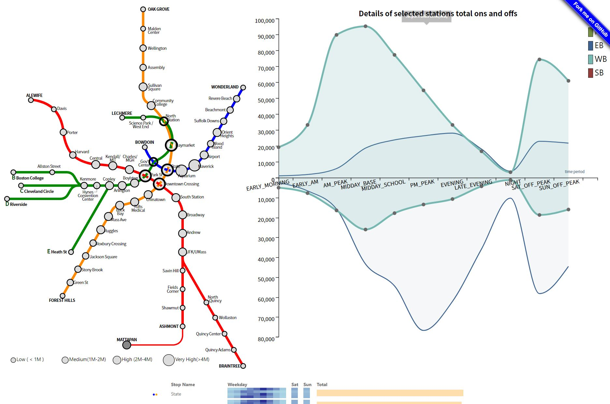

[](https://classroom.github.com/a/h8SwtrsU)
# Boston MBTA Traffic Visualization


<!-- TABLE OF CONTENTS -->
<details>
  <summary>Table of Contents</summary>
  <ol>
    <li>
      <a href="#about-the-project">About The Project</a>
    </li>
    <li><a href="#features">Features</a></li>
    <li><a href="#motivation">Motivation</a></li>
    <li><a href="#technologies-used">Technologies Used</a></li>
    <li><a href="#files">Files</a></li>
    <li><a href="#data">Data</a></li>
    <li><a href="#setup-instructions">Setup Instructions</a></li>
    <li><a href="#usage">Usage</a></li>
    <li><a href="#future-enhancements">Future Enhancements</a></li>
    <li><a href="#contributors">Contributors</a></li>
    <li><a href="#acknowledgments">Acknowledgments</a></li>
    <li><a href="#license">License</a></li>
  </ol>
</details>

### Github Page
The project is hosted on GitHub Pages. You can view it live here: [Boston MBTA Traffic Visualization](https://cosi116a-brandeis-infovis-fall23.github.io/cosi-116a-f24-final-project-repository-Team-12/).

## About The Project

[](images/screenshoot.JPG)

This project focuses on visualizing the traffic flow data of Boston's MBTA (Massachusetts Bay Transportation Authority) network. It provides interactive and intuitive visualizations to analyze station congestion, passenger flow patterns, and traffic trends effectively.

## Features
- **Interactive MBTA Map**: Visualizes station data using an SVG map, with selectable stations linked to other charts.
- **Line Chart**: Displays passenger flow over time, segmented by directions and stations.
- **Bar Chart**: Highlights detailed passenger flow statistics for different time periods.
- **Tree Map**: Groups stations based on average flow into high, medium, and low traffic categories.
- **Tooltip**: Provides additional information on hover for enhanced interactivity.

## Motivation
The project aims to provide insights into Boston's public transportation traffic patterns:
- Identifying traffic congestion hotspots.
- Understanding flow differences by time period and route.
- Facilitating informed decision-making for transportation planning.

## Technologies Used
- [D3.js](https://d3js.org/) for interactive visualizations.
- HTML/CSS for structuring and styling the interface.
- JavaScript modules for specific visualizations (`linechart.js`, `barchart.js`, `mbtamap.js`, etc.).

## Files
- **HTML Files**
  - `index.html`: Main entry point integrating all components.
- **JavaScript Files**
  - **Used Files**:
    - `linechart.js`: Creates a line chart for time-series analysis.
    - `barchart.js`: Displays detailed traffic flow information in bar chart format.
    - `mbtamap.js`: Implements the interactive map of MBTA stations.
    - `tooltip.js`: Handles tooltip display for interactivity.
    - `visualization.js`: Orchestrates the linkage between visualizations.

  - **Not Used Files**:
    - `treemap.js`: Groups stations into traffic categories and visualizes them (currently not being called or used).
    - `map.js`: Defines a visualization for mapping data points with grouped connections and legends (currently not being called or used).
- **CSS**
  - `style.css`: Styles for the webpage and visualizations.

## Data
- **Sources**:
  - MBTA Rapid Transit SVG Map: [Link](https://commons.wikimedia.org/wiki/File:MBTA_Rapid_Transit.svg)
  - MBTA Ridership Data: [Link](https://mbta-massdot.opendata.arcgis.com/datasets/80a379ebaa374cfd836ca4d3880ceda4_0/explore)
- **Preprocessing**:
  - Calculated total flow (ons + offs).
  - Filtered and grouped data by stations and time periods.

## Setup Instructions
1. Clone the repository:
   ```bash
   git clone https://github.com/COSI116A-Brandeis-InfoVis-Fall23/cosi-116a-f24-final-project-repository-Team-12.git

2. Navigate to the project directory:
    ```bash
    cd <project-directory>

3. Run Server in Ternimal 
    ```bash
    python -m http.server 8000


## Usage
1. Select a station on the MBTA map to highlight related data in the bar chart and line chart.
2. Hover over chart elements to view details in tooltips.
3. Analyze passenger flow trends and congestion patterns interactively.

## Future Enhancements
- Improved bar chart to show separate totals for on/off flow.
- Enhanced treemap with dynamic filtering options.
- Integration of real-time traffic data for live updates.

## Contributors
- **Qiping Zhang** - [qipingzhang@brandeis.edu](mailto:qipingzhang@brandeis.edu)
- **Quinn Zhong** - [zixuanzhong@brandeis.edu](mailto:zixuanzhong@brandeis.edu)
- **Han Wu** - [hanwu@brandeis.edu](mailto:hanwu@brandeis.edu)
- **Ziming Zeng** - [zimingzeng@brandeis.edu](mailto:zimingzeng@brandeis.edu)


## Acknowledgments
- [D3.js](https://d3js.org/) by Mike Bostock.
- SVG Map from Wikimedia Commons.
- MBTA Ridership Data by MBTA Open Data.

## License
This project is for educational purposes and does not include any warranties. Licensed under Brandeis.
